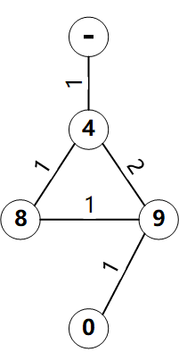

# 题解
----
* 这题由于涉及到每个站点车辆收集的问题，因此不能单纯的用Dijkstra算法。
* 由于Dijkstra算法是基于动态规划的算法，那么涉及到车辆数量的变量也应该满足最优子结构的性质，但是以下这个例子却说明这并不满足最优子结构  

* 换种思路，利用**Dijkstra+DFS**方法去寻找最优点。
* 利用Dijkstra算法找出从源点到终点的所有最短路径树，再利用DFS算法对这颗树进行递归找出满足题目要求的路径
* 在DFS堆最短路径树进行遍历时，是从终点向源点前进的，那么每个点保持两个变量分别表示从终点到当前车站所需要从PBMC送来的车辆数sent和能被收集走的车辆数collect。从终点向源点遍历过程中，这两个变量满足一下关系：
	* if bikes < Cmax/2  
	*sent-cur* = *sent-pre* + Cmax/2 - bikes  
	*collect-cur* = *collect-cur*
	* if bikes >= Cmax/2
		* if bikes-Cmax/2 > *sent-pre*  
		*sent-cur* = 0  
		*collect-cur* = *collect-pre* + bike - Cmax/2 -*sent-pre*
		* if bikes-Cmax/2 <= *sent-pre*  
		*sent-cur* = *sent-pre* - bikes + Cmax/2  
		*collect-cur* = *collect-pre*
* 最终选择满足题目的最优路径即可
